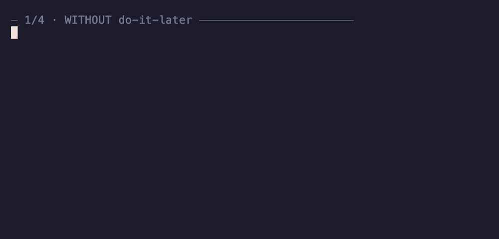

# Do It Later

> ### Your agent forgets its promises. The machine doesn't.
>
> Every *"I'll do that later"* your agent says lands in a ledger — and comes back on its
> own when it's due.

[](https://github.com/zl190/do-it-later/actions/workflows/ci.yml)
[](LICENSE)

Your own "later" has containers — issues, notes, *read-it-later*. But when the **agent**
says *"I'll revisit this once the refactor lands"*, that promise lives nowhere: not an
issue, not a file, just tokens in a context window that's about to die. The session ends
and the promise was never real — you don't even register it as one. Asking the model to
remember doesn't work ([the benchmarks are brutal](#related-work)). So first, this gives
the agent's promises the queue they never had.

But everyone also knows why read-it-later lists die anyway: **they have no trigger** — the
list just waits for you to remember it exists. So this queue ships with the half that was
always missing: every commitment carries a **machine-decidable condition** (a due date or
a shell check), and **mechanical ignition surfaces** fire it back into the conversation
when the condition holds. *Don't make the model remember — make the machine trip.*
Ignition rate = event rate, independent of model recall.

The name is the crime: the phrase this tool polices is the phrase that invokes it.

## How it works

```
"let's do it later"                      SessionStart hook (every session)
        │                                        │ due/invalid/malformed?
        ▼                                        ▼
~/.claude/memory/deferrals.tsv  ──scan──►  [pm-ledger] block in context:
  id | due | check | action | context      "disposition each: do / re-condition / kill"
```

- **Condition** = a due date (`2026-09-16`, fires when today ≥ due) **or** a shell check
  (`grep -q needle config`, fires when it exits 0). *"When it matures" is not a condition* —
  `add` rejects condition-less rows, and any that sneak in come out as INVALID red.
- **Context** rides along: each row carries a self-contained line that lets a cold session
  resume the work without the original conversation.
- **Green is silent**: when nothing is due, the hook injects zero tokens.
- **Malformed rows are red, never invisible**: wrong column count, empty fields, bad status,
  bad dates — all surface as MALFORMED (scan exit 1, `doctor` finding). A commitment that
  quietly disappears is the exact failure this tool exists to prevent.

## Without it / with it

<p align="center"></p>

<details><summary>Abridged real transcript (text)</summary>

```console
$ scan.sh add someday-refactor --action "refactor once the architecture matures"
REJECT someday-refactor: no machine-decidable condition — give --due/--check, do it now, or kill it honestly

$ scan.sh scan
DUE  fix-flaky-timer — revisit the flaky timer test
     context: tests/timer.spec.ts; repro: run 20x; suspect: fake-clock drift
     cond: due=2026-08-15 | source: "we'll fix it later" in PR #88 review
-- pm-ledger: 1 due, 0 invalid, 0 malformed (of 3 pending) --
```

Then a **new session** opens. Nobody mentions the ledger — the opening prompt is just
*"start today's work"*. The SessionStart hook injects the due rows, and the agent's first
reply plans them first, closing verb included:

> **Start now:** `fix-flaky-timer` — debug the timer test, run 20×, verify the fake-clock
> drift fix … then `scan.sh done fix-flaky-timer`.

It didn't remember. It got tripped.

</details>

Re-record the GIF anytime: `vhs docs/demo.tape` (deterministic, throwaway ledger).

## Install

Requires: bash, awk, python3 (install script only). Claude Code as the host harness.

```bash
git clone https://github.com/zl190/do-it-later ~/do-it-later
~/do-it-later/install.sh
```

`install.sh` does exactly two things, idempotently: symlinks the repo into
`~/.claude/skills/do-it-later`, and registers the SessionStart hook in
`~/.claude/settings.json` (backing the file up first to `settings.json.bak.<timestamp>`).
`uninstall.sh` reverses both. New settings take effect from the next session.

Verify:

```bash
bash ~/do-it-later/tests/run.sh
```

32 mutation self-checks: due must red / not-due must green, both directions, plus ledger
integrity, TSV-injection guards, and lifecycle round-trips. Runs against a temp ledger —
your real one is untouched.

## Use

```bash
S=~/.claude/skills/do-it-later/scripts/scan.sh

bash $S add fix-flaky-timer --due 2026-09-01 \
  --action "revisit the flaky timer test after the scheduler rewrite lands" \
  --context "test: tests/timer.spec.ts; flake repro: run 20x; suspect: fake-clock drift"

bash $S add bump-node --check '[ "$(node -e "console.log(process.versions.node.split(\".\")[0])")" -ge 24 ]' \
  --action "drop the polyfill once node >= 24 is the floor" \
  --context "polyfill lives in src/compat.ts; delete + run full suite"

bash $S list            # the queue, with DUE!/INVALID markers
bash $S fire <id>       # start one manually, don't wait for the trigger
bash $S done <id>       # finished
bash $S kill <id> "superseded by the v2 design"   # honest kill, reason required
bash $S doctor          # integrity + ignition-surface liveness findings
```

In-session, the skill (SKILL.md) teaches the agent the other half: capture deferral language
into the ledger as it happens, sweep the conversation at wrap-up, and disposition every
tripped commitment instead of sliding past.

## When this does NOT work (honest boundary)

Three conditions must all hold: **captured** (it's in the ledger) ∧ **decidable** (the
condition is a date or an exit code) ∧ **live** (the ignition surface actually runs).

- Not captured → the machine is silent forever. Capture is model-side discipline; the skill
  narrows the gap (trigger phrases + wrap-up sweep) but cannot close it.
- Subjective condition → rejected at `add`; smuggled-in rows show as INVALID. That is
  exposure, not a solution.
- Dead surface → `doctor` catches known shapes (unregistered hook, unknown surface name);
  a scheduler job cannot be liveness-checked from bash — verify it in the scheduler itself.

Also: `check` commands are run by `scan` — keep them instant, read-only, idempotent. There
is no sandbox and no timeout around them (a slow check delays every session start).

## Related work

- [todo_or_die](https://github.com/searls/todo_or_die) (Ruby) / [expiring-todo-comments](https://github.com/sindresorhus/eslint-plugin-unicorn/blob/main/docs/rules/expiring-todo-comments.md)
  (eslint): the same semantics for code comments, tripped in build/lint runtimes. This tool
  moves both ends: capture from **conversation**, ignite on **agent-session events**. One
  cautionary tale ported as a design rule: the eslint rule ships `checkDates: false` — its
  flagship semantic is dead by default. Here, date firing is always on, no environment guards.
- Continuity/session-state ledgers and agent-memory skills (e.g. Continuity Ledger, Agent
  Memory): **retrospective** — they preserve what happened for later recall. This ledger is
  **prospective** — commitments with tripwires. Complementary, not competing.
- Prospective-memory research ([PM-Bench](https://arxiv.org/abs/2607.12385),
  [TriggerBench](https://arxiv.org/abs/2606.23459) — even frontier models are unreliable at
  spontaneously acting on deferred intentions; commitment-record vocabulary from the
  [Always-On agents survey](https://arxiv.org/abs/2606.30306)): benchmarks the model-recall
  route this tool deliberately avoids.

## License

MIT
